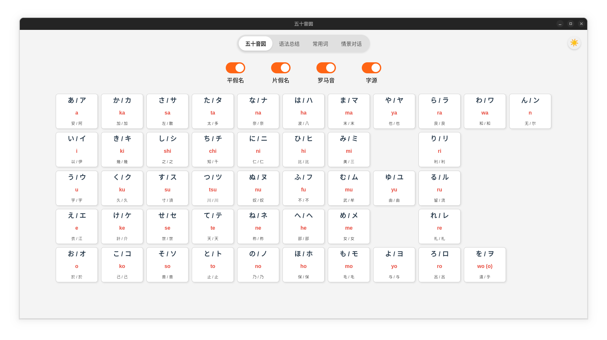

# kana

A gentle companion for Japanese beginners

## Screenshots

## Run

- Open `kana.html` in your browser
- Or run as a electron app with `npm start` in `desktop/`
  - Need to install `electron` first running `npm install electron --save-dev` in `desktop/`
